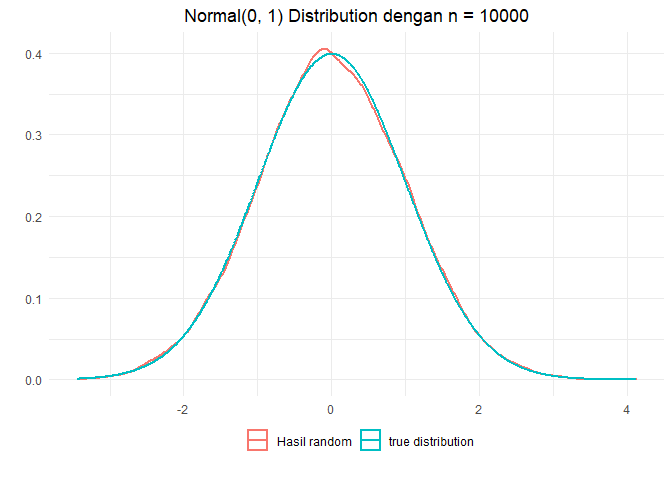
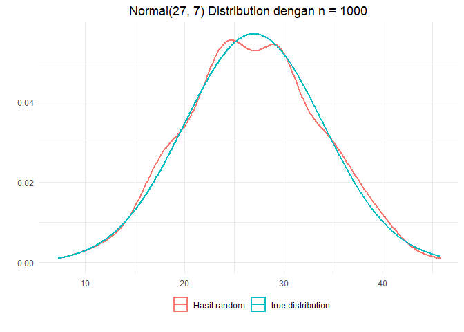
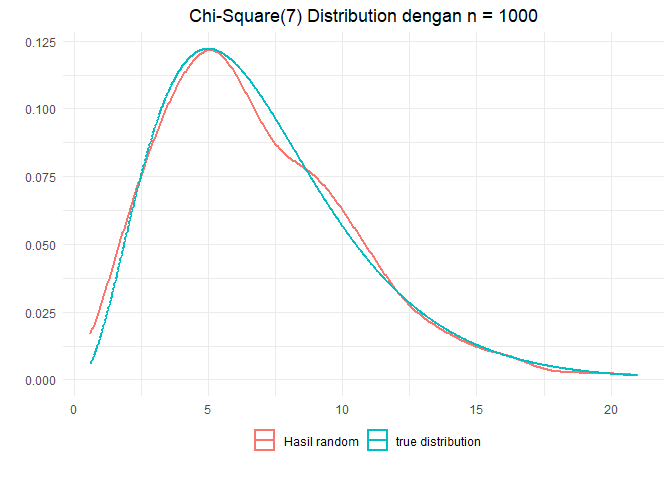
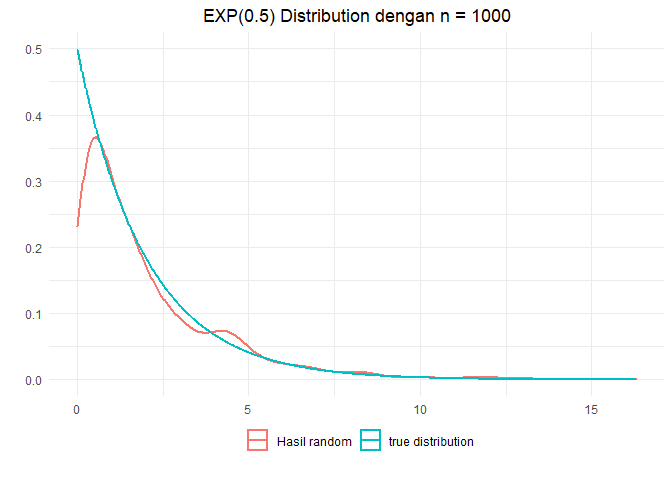
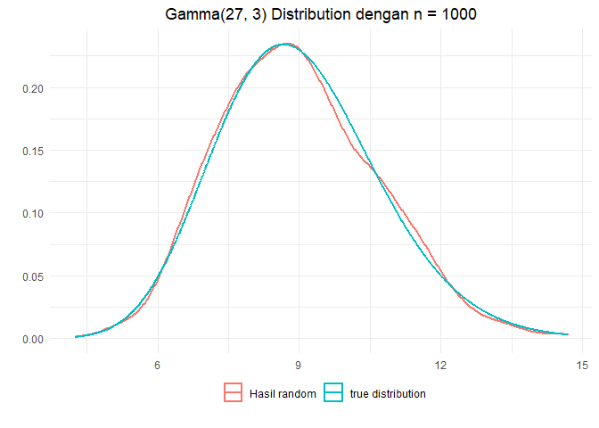
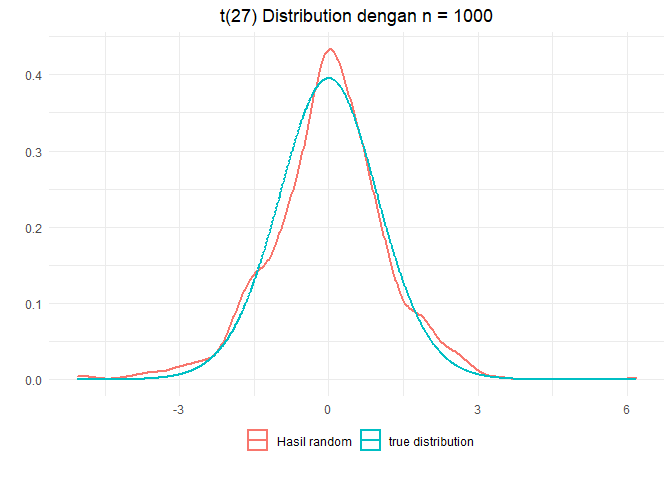
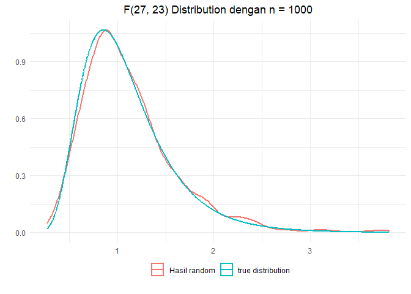
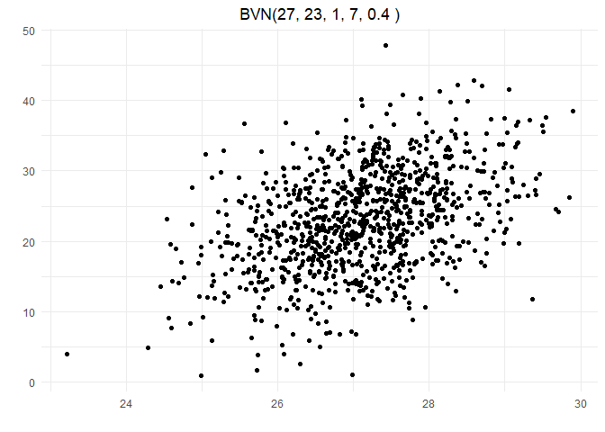
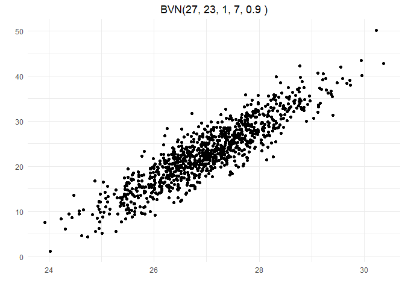

# Transformasi Langsung  

Distribusi Uniform akan dibangkitkan menggunakan fungsi bawaan R yaitu
`runif`, selain menggunakan fungsi bawaan tersebut kita juga bisa
menggunakan fungsi buatan sendiri dengan menggunakan algoritma Linear
Congruential Generator (LCG)

``` r
library(ggplot2)
```

Membangkitkan N(0,1)
====================

### Membuat Fungsi


``` r
rand.z <- function(n){
      u1 <- runif(ceiling(n/2), 0, 1)
      u2 <- runif(ceiling(n/2), 0, 1)
      
      z1 <- sqrt(-2 * log(u1)) * cos(2 * pi * u2)
      z2 <- sqrt(-2 * log(u1)) * sin(2 * pi * u2)
      
      y <- c(z1, z2)
      y[1:n]
}
```

### Mencoba Fungsi


``` r
z <- rand.z(10000)
paste("Mean :", mean(z), ";  Sd :", sd(z))
```

    ## [1] "Mean : 0.00224596409391118 ;  Sd : 0.994674396312608"

### Memvisualisasikan


``` r
ggplot() +
      geom_density(data = data.frame(x = z), 
                   aes(x, color = "Hasil random"), size = 1) +
      stat_function(fun = dnorm, n = 1000, args = list(mean = 0, sd = 1), 
                                size = 1, aes(color = "true distribution")) +
      labs(x = "", y = "", title = "Normal(0, 1) Distribution dengan n = 10000") +
      theme_minimal() +
      theme(legend.position = "bottom",
            legend.title = element_blank(),
            legend.box.margin = margin(-20, 0, 10, 0),
            plot.title = element_text(hjust = 0.5))
```



Membangkitkan Normal(*μ*, *σ*)
==============================

### Buat Fungsi


``` r
rand.normal <- function(n, mu = 0, sigma = 1){
      z <- rand.z(n)
      sigma * z + mu
}
```

### Mencoba Fungsi


Misalnya kita ingin membangkitkan distribusi Normal(27, 7)

``` r
mu <- 27
sigma <- 7
normal <- rand.normal(1000, mu, sigma)
paste("Mean :", mean(normal), ";  Sd :", sd(normal))
```

    ## [1] "Mean : 26.9171179989711 ;  Sd : 6.82248097667341"

### Memvisualisasikan


``` r
ggplot() +
      geom_density(data = data.frame(x = normal), 
                   aes(x, color = "Hasil random"), size = 1) +
      stat_function(fun = dnorm, n = 1000, args = list(mean = mu, sd = sigma), 
                                size = 1, aes(color = "true distribution")) +
      labs(x = "", y = "", title = "Normal(27, 7) Distribution dengan n = 1000") +
      theme_minimal() +
      theme(legend.position = "bottom",
            legend.title = element_blank(),
            legend.box.margin = margin(-20, 0, 10, 0),
            plot.title = element_text(hjust = 0.5))
```



Membangkitkan *χ*<sub>*v*</sub><sup>2</sup>
===========================================

### Membuat Fungsi


``` r
rand.chi <- function(n, v){
      y <- rep(0, n)
      for(i in 1:v){
            z <- rand.z(n)
            y <- y + z^2
      }
      y
}
```

### Mencoba Fungsi


Misalnya kita ingin membangkitakn *χ*<sub>7</sub><sup>2</sup>

``` r
df <- 7
chi <- rand.chi(1000, df)
head(chi, 10)
```

    ##  [1] 10.321748 10.935239  3.368243  6.295458  8.828404  8.923808  6.841031
    ##  [8]  6.994560  2.004871  7.885264

### Memvisualisasikan


``` r
ggplot() +
      geom_density(data = data.frame(x = chi), 
                   aes(x, color = "Hasil random"), size = 1) +
      stat_function(fun = dchisq, n = 1000, args = list(df = df), 
                                size = 1, aes(color = "true distribution")) +
      labs(x = "", y = "", title = "Chi-Square(7) Distribution dengan n = 1000") +
      theme_minimal() +
      theme(legend.position = "bottom",
            legend.title = element_blank(),
            legend.box.margin = margin(-20, 0, 10, 0),
            plot.title = element_text(hjust = 0.5))
```



Membangkitkan EXP(*λ*)
======================

### Buat Fungsi


``` r
rand.exp <- function(n, lambda){
      u <- runif(n)
      -(1/lambda)*log(u)
}
```

### Mencoba Fungsi


``` r
lambda <- 0.5
y <- rand.exp(1000, lambda)
```

### Memvisualisasikan


``` r
ggplot() +
      geom_density(data = data.frame(x = y), 
                   aes(x, color = "Hasil random"), size = 1) +
      stat_function(fun = dexp, n = 1000, args = list(rate = lambda), 
                                size = 1, aes(color = "true distribution")) +
      labs(x = "", y = "", title = "EXP(0.5) Distribution dengan n = 1000") +
      theme_minimal() +
      theme(legend.position = "bottom",
            legend.title = element_blank(),
            legend.box.margin = margin(-20, 0, 10, 0),
            plot.title = element_text(hjust = 0.5))
```



Membangkitkan Gamma(*α*, *β*)
=============================

### Buat Fungsi


``` r
rand.gamma <- function(n, alpha, beta){
      y <- rep(0, n)
      for(i in 1:alpha){
            u <- runif(n)
            y <- y + log(u)
      }
      -(1/beta) * y
}
```

### Mencoba Fungsi


``` r
alpha <- 27
beta <- 3
y <- rand.gamma(1000, alpha, beta)
head(y, 10)
```

    ##  [1]  9.147840 10.807682 13.771562 10.249863  9.157160 11.186608  8.096383
    ##  [8]  9.630841  8.202449  8.593070

### Memvisualisasikan


``` r
ggplot() +
      geom_density(data = data.frame(x = y), 
                   aes(x, color = "Hasil random"), size = 1) +
      stat_function(fun = dgamma, n = 1000, args = list(shape = alpha, rate = beta), 
                                size = 1, aes(color = "true distribution")) +
      labs(x = "", y = "", title = "Gamma(27, 3) Distribution dengan n = 1000") +
      theme_minimal() +
      theme(legend.position = "bottom",
            legend.title = element_blank(),
            legend.box.margin = margin(-20, 0, 10, 0),
            plot.title = element_text(hjust = 0.5))
```



Membangkitkan *t*<sub>*v*</sub>
===============================

### Buat Fungsi


``` r
rand.t <- function(n, v){
      z <- rand.z(n)
      chi <- rand.chi(n, v)
      z / (chi/v)
}
```

### Mencoba Fungsi


``` r
df <- 27
t <- rand.t(1000, df)
head(t, 10)
```

    ##  [1]  2.4341732  1.1550422 -0.1099999 -1.4356674  0.2098498  0.2597585
    ##  [7] -0.1922736  0.8045584 -1.7365674  0.9678414

### Memvisualisasikan


``` r
ggplot() +
      geom_density(data = data.frame(x = t), 
                   aes(x, color = "Hasil random"), size = 1) +
      stat_function(fun = dt, n = 1000, args = list(df = df), 
                                size = 1, aes(color = "true distribution")) +
      labs(x = "", y = "", title = "t(27) Distribution dengan n = 1000") +
      theme_minimal() +
      theme(legend.position = "bottom",
            legend.title = element_blank(),
            legend.box.margin = margin(-20, 0, 10, 0),
            plot.title = element_text(hjust = 0.5))
```



Membangkitkan *F*<sub>*v*<sub>1</sub>, *v*<sub>2</sub></sub>
============================================================

### Buat Fungsi


``` r
rand.f <- function(n, v1, v2){
      chi1 <- rand.chi(n, v1)
      chi2 <- rand.chi(n, v2)
      (chi1/v1)/(chi2/v2)
}
```

### Mencoba Fungsi


``` r
df1 <- 27
df2 <- 23
f <- rand.f(1000, df1, df2)
head(t, 10)
```

    ##  [1]  2.4341732  1.1550422 -0.1099999 -1.4356674  0.2098498  0.2597585
    ##  [7] -0.1922736  0.8045584 -1.7365674  0.9678414

### Memvisualisasikan


``` r
ggplot() +
      geom_density(data = data.frame(x = f), 
                   aes(x, color = "Hasil random"), size = 1) +
      stat_function(fun = stats::df, n = 1000, args = list(df1 = df1, df2 = df2), 
                                size = 1, aes(color = "true distribution")) +
      labs(x = "", y = "", title = "F(27, 23) Distribution dengan n = 1000") +
      theme_minimal() +
      theme(legend.position = "bottom",
            legend.title = element_blank(),
            legend.box.margin = margin(-20, 0, 10, 0),
            plot.title = element_text(hjust = 0.5))
```



Membangkitkan Bivariate Normal
==============================

### Buat Fungsi


``` r
rand.bvn <- function(n, mu1, mu2, sigma1, sigma2, r){
      u1 <- rand.z(n)
      u2 <- rand.z(n)
      
      norm <- matrix(ncol = 2, nrow = n)
      norm[,1] <- mu1 + sigma1 * u1
      norm[,2] <- mu2 + r * sigma2 * u1 + sigma2 * u2 * sqrt(1 - r^2)
      norm
}
```

### Mencoba Fungsi


``` r
mu1 <- 27
mu2 <- 23
sigma1 <- 1
sigma2 <- 7
r <- 0.4
bvn <- rand.bvn(1000, mu1, mu2, sigma1, sigma2, r)
head(bvn, 10)
```

    ##           [,1]     [,2]
    ##  [1,] 26.89028 32.84917
    ##  [2,] 28.34606 34.64333
    ##  [3,] 25.30536 15.33391
    ##  [4,] 26.41535 26.85808
    ##  [5,] 27.72778 16.87822
    ##  [6,] 28.04288 23.86173
    ##  [7,] 25.77555 20.20315
    ##  [8,] 26.58125 31.61157
    ##  [9,] 26.33427 18.24600
    ## [10,] 26.74528 27.06575

### Memvisualisasikan


``` r
ggplot() +
      geom_point(data = data.frame(bvn), aes(x = X1, y = X2)) +
      labs(x = "", y = "", title = paste("BVN(27, 23, 1, 7,", r , ")")) +
      theme_minimal() +
      theme(legend.position = "bottom",
            legend.title = element_blank(),
            legend.box.margin = margin(-20, 0, 10, 0),
            plot.title = element_text(hjust = 0.5))
```



``` r
r <- 0.9
bvn <- rand.bvn(1000, mu1, mu2, sigma1, sigma2, r)

ggplot() +
      geom_point(data = data.frame(bvn), aes(x = X1, y = X2)) +
      labs(x = "", y = "", title = paste("BVN(27, 23, 1, 7,", r , ")")) +
      theme_minimal() +
      theme(legend.position = "bottom",
            legend.title = element_blank(),
            legend.box.margin = margin(-20, 0, 10, 0),
            plot.title = element_text(hjust = 0.5))
```



Membangkitkan Multivariate Normal
=================================

### Fungsi Mencari Matrix A


``` r
getA <- function(matriks){
      kolom <- baris <- ncol(matriks)
      temp <- c()
      a <- matrix()
      for (j in 1:kolom) {
            for (i in 1:baris) {
                  atas <- 0
                  bawah <- 0
                  if (j > 1) {
                        for (k in 1:(j-1)) {
                              atas <- atas + (a[i,k] * a[j,k])
                              bawah <- bawah + (a[j,k]^2)
                        }
                  }
                  elem <- (matriks[i,j] - atas) / sqrt(matriks[j,j] - bawah)
                  temp <- c(temp, elem)
            }
            a <- matrix(temp, nrow=baris)
      }
      a
}
```

### Membuat Fungsi


``` r
rand.mvn <- function(n, mu, sigma){
      if(!is.vector(mu)) stop("mu harus dalam bentuk vector")
      if(!is.matrix(sigma)) stop("sigma harus dalam bentuk matrix")
      if(nrow(sigma) != ncol(sigma)) stop("Dimensi sigma berbeda")
      if(nrow(sigma) != length(mu)) stop("Dimensi sigma dan mu berbeda")
      
      a <- getA(sigma)
      x <- matrix(0, ncol = length(mu), nrow = n)
      for(i in 1:n){
            z <- rand.z(length(mu))
            x[i, ] <- a %*% z + mu
      }
      x
}
```

### Mencoba Fungsi


Misalnya kita ingin menegerate MVN dengan

$$
\\mu = 
\\begin{pmatrix}
27 \\\\
23 \\\\
71 
\\end{pmatrix}
$$
dan
$$
\\sum = 
\\begin{pmatrix}
9 & 5 & 4 \\\\
5 & 16 & 8 \\\\
4 & 8 & 25
\\end{pmatrix}
$$

``` r
mu <- c(27, 23, 71)
sigma <- matrix(c(9,5,4,5,16,8,4,8,25), nrow=3)
mvn <- rand.mvn(1000, mu, sigma)
print(paste("Mean :", toString(apply(mvn, 2, mean))))
```

    ## [1] "Mean : 27.0165394824874, 23.0664857451546, 70.8680347162056"

``` r
print(cov(mvn))
```

    ##          [,1]      [,2]      [,3]
    ## [1,] 9.407962  5.329043  3.754972
    ## [2,] 5.329043 16.280429  7.761350
    ## [3,] 3.754972  7.761350 23.264561