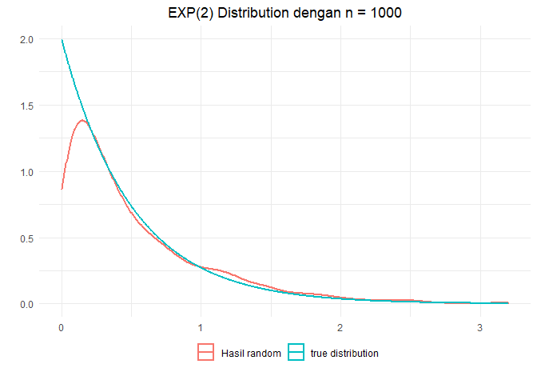
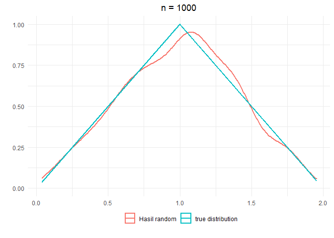
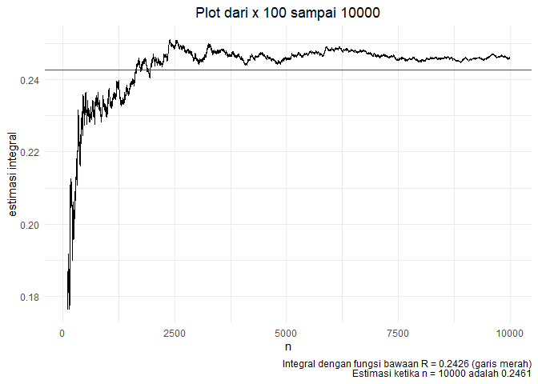
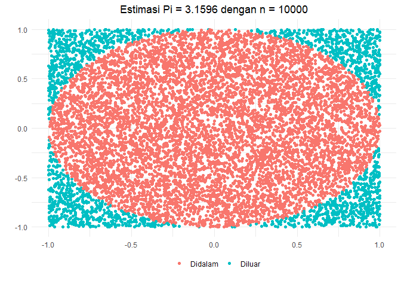

# Transformasi Tak Langsung  

``` r
library(ggplot2)
```

Metode Inverse
==============

Misalnya kita akan membangkitkan Exponential. Dengan menghitungan
diperoleh inverse dari fungsi kumulatif sebagai berikut

*y* =  − *β*ln (1 − *x*)

``` r
beta <- 0.5 
n <- 1000
x <- runif(n)
y <- -beta*log(1-x)

ggplot() +
      geom_density(data = data.frame(x = y), 
                   aes(x, color = "Hasil random"), size = 1) +
      stat_function(fun = dexp, n = 1000, args = list(rate = 1/beta), 
                                size = 1, aes(color = "true distribution")) +
      labs(x = "", y = "", title = "EXP(2) Distribution dengan n = 1000") +
      theme_minimal() +
      theme(legend.position = "bottom",
            legend.title = element_blank(),
            legend.box.margin = margin(-20, 0, 10, 0),
            plot.title = element_text(hjust = 0.5))
```



Metode Penerimaan dan Penolakan
===============================

Misalnya kita ingin membangkitkan data dari sebuah fungsi pdf sebagai
berikut

$$
f(x) =
\\begin{cases}
x&\\text{if $0\<x\<1$}\\\\
(2-x)&\\text{if $1\\le x\<2$}\\\\
0&\\text{otherwise}
\\end{cases}
$$

Yang mana fungsi diatas merupakan fungsi segitiga

### Membuat Fungsi Densitas


``` r
fx <- function(x){
      y <- rep(0, length(x))
      for(i in 1:length(x)){
            if((0<x[i]) & (x[i]<1)) y[i] <- x[i]
            else if((1 <= x[i]) & (x[i] < 2)) y[i] <- 2 - x[i]
            else y[i] <- 0
      }
      y
}
```

### Fungsi Rejection


``` r
rejection <- function(fx, a, b, k){
      while (TRUE) {
            x <- runif(1, a, b)
            y <- runif(1, 0, k)
            if(y < fx(x)) return(x) 
      }
}
```

### Fungsi Generate Random


``` r
rand.fx <- function(n){
      y <- rep(0, n)
      for(i in 1:n){
            y[i] <- rejection(fx, 0, 2, 1)
      }
      y
}
```

### Mencoba Fungsi


``` r
y <- rand.fx(1000)

ggplot() +
      geom_density(data = data.frame(x = y), 
                   aes(x, color = "Hasil random"), size = 1) +
      stat_function(fun = fx, n = 1000, 
                                size = 1, aes(color = "true distribution")) +
      labs(x = "", y = "", title = "n = 1000") +
      theme_minimal() +
      theme(legend.position = "bottom",
            legend.title = element_blank(),
            legend.box.margin = margin(-20, 0, 10, 0),
            plot.title = element_text(hjust = 0.5))
```



Mencari Integral Tentu
======================

Misalnya kita ingin mencari integral berikut
∫<sub>0</sub><sup>1</sup>*s**i**n*<sup>2</sup>(10*x*<sup>2</sup>)*s**i**n*(*x*)*x* + 0.1 *d**x*

### Mencari Integral Lipat 1


Gunakan `n` yang besar agar hasilnya makin akurat

``` r
a <- 0
b <- 1
f <- function(x) ((sin(10 * x^2))^2 * sin(x)) * x + 0.1

n <- 100000
x <- runif(n, a, b)
y <- f(x)
ybar <- mean(y)
integral <- (b-a)*ybar
integral
```

    ## [1] 0.2431156

``` r
integrate(f, a, b)
```

    ## 0.2426328 with absolute error < 2.2e-06

### Mencari Integral Lipat 3


Algortima dibawah ini hanya perluasan dari algortima sebelumnya (cek
modul). Misalnya kita akan mencari integral dari

$$
\\int\_{10}^{11}{\\int\_0^{2\\pi}{\\int\_0^\\pi}{\\frac{9}{2\\pi}x^2sin^3(x)dxdydz}}
$$
Solusi eksak integral di atas menghasilkan 1324

``` r
a1 <- 0
b1 <- pi
a2 <- 0
b2 <- 2*pi
a3 <- 10
b3 <- 11

n <- 1000000
x <- runif(n,a1,b1)
y <- runif(n,a2,b2)
z <- runif(n,a3,b3)

fs.int <- function(x,y,z){
      k<-9/(2*pi)
      (sin(x))^3*k*z^2
}

fs <- fs.int(x,y,z)
int <- (b3-a3) * (b2-a2) * (b1-a1) * mean(fs)
int
```

    ## [1] 1320.695

Terlihat dengan `n = 1000000`, hasil yang diperoleh sangat mendekati
dengan hasil eksaknya

### Melihat Efek Jumlah N


#### Buat Fungsi

``` r
simulasiIntegral <- function(n, func, xmin = 0, xmax = 1, batasBawahPlot = 100, k = 1, plot = TRUE){
      res <- rep(0, n)
      numberIn <- 0
      for(i in 1:n){
            x1 <- runif(1, xmin, xmax)
            y1 <- runif(1, 0, k)
            g1 <- func(x1)
            if(y1 <= g1){
                  numberIn <- numberIn + 1
            }
            res[i] <- numberIn/i
      }
      
      if(plot){
         if(n < batasBawahPlot) batasBawahPlot <- 0
         realInt <- integrate(func, xmin, xmax)$value
      
         require(ggplot2)
         ggplot() +
               geom_line(data = data.frame(y = res[batasBawahPlot:n]), aes(y = y, x = batasBawahPlot:n)) +
               geom_hline(yintercept = realInt, color = "red") +
               labs(x = "n", 
                    y = "estimasi integral", 
                    title = paste("Plot dari x", batasBawahPlot, "sampai", n),
                    caption = paste("Integral dengan fungsi bawaan R =", round(realInt,4), "(garis merah)\nEstimasi ketika n =", n , "adalah", res[n])) +
               theme_minimal() +
               theme(legend.position = "bottom",
                     legend.title = element_blank(),
                     legend.box.margin = margin(-20, 0, 10, 0),
                     plot.title = element_text(hjust = 0.5))
      } else{
         return(res[n])
      }
}
```

#### Mencoba Fungsi

Fungsi diatas akan dicoba pada integral

∫<sub>0</sub><sup>1</sup>*s**i**n*<sup>2</sup>(10*x*<sup>2</sup>)*s**i**n*(*x*)*x* + 0.1 *d**x*

``` r
f <- function(x) ((sin(10 * x^2))^2 * sin(x)) * x + 0.1
set.seed(72)
simulasiIntegral(10000, func = f)
```



Terlihat ketika `n` masih kecil nilai estimasinya masih berfluktuatif
sedangkan ketika `n` sudah memasuki 6000 nilai estimasinya sudah mulai
stabil dengan error yang kecil yaitu kurang dari 0.01. Jadi semakin
besar nilai `n` maka nilai estimasi integralnya akan semakin dekat yang
sebenarnya (hasil eksak)

Mencari Nilai *π*
=================

### Membuat Fungsi


``` r
getPi <- function(n, plot = FALSE){
   x <- runif(n, -1, 1)
   y <- runif(n, -1, 1)   
   
   # Menghitung titik yang ada didalam lingkaran
   z <- sqrt(x^2 + y^2)
   inCircle <- sum(z <= 1)
   estimasi <- 4 * inCircle / n  
   
   if(plot){
      require(ggplot2)
      df <- data.frame(x = x,
                       y = y,
                       inCircle = ifelse(z <= 1, "Didalam", "Diluar"))
      ggplot() +
         geom_point(data = df, aes(x = x, y = y, color = inCircle)) +
         labs(x = "", 
              y = "",
              title = paste("Estimasi Pi =", estimasi, "dengan n =", n)) +
         theme_minimal() +
         theme(legend.position = "bottom",
               legend.title = element_blank(),
               legend.box.margin = margin(-20, 0, 10, 0),
               plot.title = element_text(hjust = 0.5))
         
   } else{
      estimasi
   }
}
```

### Mencoba Fungsi


``` r
set.seed(27)
getPi(10000, plot = TRUE)
```



Terlihat dengan `n = 10000` diperoleh estimasi nilai *π* = 3.1596, nilai
tersebut juga akan berubah sesuai dengan seed yang digunakan. Berikut
akan dicoba untuk `n = 1000000`

``` r
set.seed(72)
estimasiPi <- getPi(1000000, plot = FALSE)
estimasiPi
```

    ## [1] 3.14416

``` r
pi
```

    ## [1] 3.141593

``` r
estimasiPi - pi
```

    ## [1] 0.002567346

Terlihat dengan `n = 1000000`, nilai estimasi *π* = 3.14416 dengan error
kurang lebih 0.0025 dengan nilai pi yang sebenarnya.
