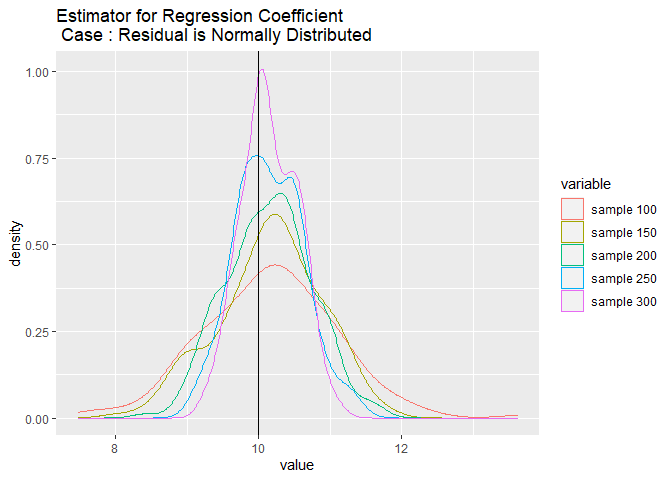
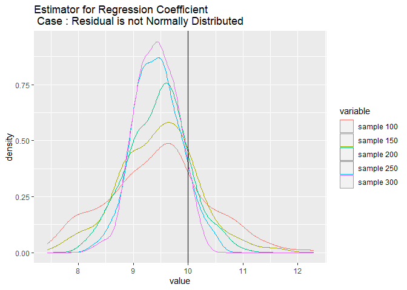

Simulasi Pelanggaran Asumsi Normalitas Pada Regresi Linear Sederhana
====================================================================

**Code by Arina Mana Sikana**

``` r
library(dplyr)
library(reshape2)
library(ggplot2)
```


Model regresi linear sederhana adalah
*Y* = *β*<sub>0</sub> + *β*<sub>1</sub>*X* + *ϵ*

Asumsi normalitas pada regresi adalah komponen error *ϵ* merupakan
random variabel yang menyebar independen dan identik mengikuti
distribusi normal dengan rata-rata 0 dan varians *σ*<sup>2</sup>

Model yang akan digunakan : *β*<sub>0</sub> = 3 dan
*b**e**t**a*<sub>1</sub> = 10

Dari model diatas akan dilakukan 2 simulasi, yaitu error berdistribusi
normal dan error tidak berdistribusi normal (akan digunakan distribusi
chi-square). Rata-rata error 1 dan error 2 sebesar 0 dengan varians yang
sama, yaitu 10.

Distribusi *c**h**i* − *s**q**u**a**r**e*(*v*) memiliki rata-rata = v
dan varians = 2v. Sehingga untuk membuat rata-ratanya menjadi 0, **kita
dapat menguranginya dengan v**

### Set Variabel


``` r
# Parameter Model
beta0 <- 3
beta1 <- 10


## Error is normally distributed
set.seed(123)
x1 <- runif(500)
e1 <- rnorm(500, 0, sqrt(10))   # normal, mean = 0, var = 10
y1 <- beta0 + beta1 * x1 + e1


## Error is not normally distributed
x2 <- runif(500)
e2 <- rchisq(500, 5) - 5     # chisq, mean = 0, var = 10
y2 <- beta0 + beta1 * x2 + e2


B <- 200 # jumlah pengulangan simulasi
```

Misalkan kita ingin melihat efek pelanggaran asumsi normalitas ini
terhadap estimator koefisien regresi b1

``` r
## Estimator for Regression Coefficient beta1
est <- function(y, x, sample, B) {
  est <- NULL
  
  set.seed(123)
  
  for (i in 1:B) {
    set.seed(i)
    fit <- lm(y ~ x, data = data.frame(x, y)[sample(length(y), sample), ])
    est[i] <- fit$coefficients[2]
  }
  
  est
}
```

### Ketika Risdual Normal


``` r
# Residual is normally distributed
est1 <- data.frame(index = 1:B)

for (i in seq(100, 300, 50)) {
  est_data1 <- est(y1, x1, i, B)
  est1 <- mutate(est1, !!paste("sample", i) := est_data1)
}

est.plot.1 = melt(est1, id.vars = 'index')

p1 <- ggplot(est.plot.1, aes(x = value, colour = variable)) + geom_density() + geom_vline(xintercept = beta1) + ggtitle("Estimator for Regression Coefficient\n Case : Residual is Normally Distributed")
p1
```



### Ketika Residual Tidak Normal


``` r
# Residual is not normally distributed
est2 <- data.frame(index = 1:B)

for (i in seq(100, 300, 50)) {
  est_data2 <- est(y2, x2, i, B)
  est2 <- mutate(est2, !!paste("sample", i) := est_data2)
}

est.plot.2 = melt(est2, id.vars = 'index')

p2 <- ggplot(est.plot.2, aes(x = value, colour = variable)) + geom_density() + geom_vline(xintercept = beta1) + ggtitle("Estimator for Regression Coefficient\n Case : Residual is not Normally Distributed")
p2
```



### Kesimpulan


Pada kasus residual berdistribusi normal, rata-rata atau nilai
ekspektasi dari estimator *b*<sub>1</sub> mendekati nilai parameternya,
yaitu *β*<sub>1</sub> = 10. Sedangkan pada kasus residual tidak
berdistribusi normal, rata-rata atau nilai ekspektasi dari estimator b1
cukup menyimpang dari nilai parameternya, yang berarti estimator
*b*<sub>1</sub> ini bias terhadap parameternya.

Simulasi Efek Pelanggaran Asumsi Normalitas Pada ANOVA
======================================================

Asumsi normalitas pada ANOVA adalah data pada setiap kelompok yang akan
diuji berdistribusi normal. Asumsi lain pada ANOVA adalah varians data
pada setiap kelompok sama.

Misalkan kita ingin melihat efek pelanggaran asumsi normalitas terhadap
tingkat kesalahan tipe I hasil uji hipotesis. Akan dilakukan 2 simulasi
yaitu :

### Ketika Beridstribusi Normal


3 kelompok data berdistribusi normal dengan rata-rata yang sama, yaitu
5. Untuk melihat hanya efek pelanggaran asumsi normalitas, varians
setiap kelompok data akan dibuat sama

#### Set Data

``` r
# Data is normally distributed
p1 <- c()
set.seed(123)

for (i in 1:1000) {
  grup1 <- rnorm(50, 5, 2)      # normal, mean = 5, var = 4
  grup2 <- rnorm(50, 5, 2)      # normal, mean = 5, var = 4
  grup3 <- rnorm(50, 5, 2)      # normal, mean = 5, var = 4
  
  test <- data.frame(Distribusi = c(rep("Kategori 1", 50), rep("Kategori 2", 50), rep("Kategori 3", 50)), Angka = c(grup1, grup2, grup3))
  
  p1[i] <- summary(aov(Angka~Distribusi, data = test))[[1]]$'Pr(>F)'[1]
}
```

#### Uji Kenormalan

``` r
by(test$Angka, INDICES = test$Distribusi, FUN = shapiro.test)
```

    ## test$Distribusi: Kategori 1
    ## 
    ##  Shapiro-Wilk normality test
    ## 
    ## data:  dd[x, ]
    ## W = 0.98815, p-value = 0.8937
    ## 
    ## ------------------------------------------------------------ 
    ## test$Distribusi: Kategori 2
    ## 
    ##  Shapiro-Wilk normality test
    ## 
    ## data:  dd[x, ]
    ## W = 0.98605, p-value = 0.8157
    ## 
    ## ------------------------------------------------------------ 
    ## test$Distribusi: Kategori 3
    ## 
    ##  Shapiro-Wilk normality test
    ## 
    ## data:  dd[x, ]
    ## W = 0.98844, p-value = 0.9031

**Asumsi normalitas : terpenuhi**

#### Uji Kesamaan Varians

``` r
bartlett.test(Angka~Distribusi, data = test)
```

    ## 
    ##  Bartlett test of homogeneity of variances
    ## 
    ## data:  Angka by Distribusi
    ## Bartlett's K-squared = 0.26263, df = 2, p-value = 0.8769

**Asumsi kesamaan varians : terpenuhi**

#### Tingkat kesalahan tipe I

``` r
sum(p1 < 0.05)/1000 
```

    ## [1] 0.038

Jika asumsi normalitas terpenuhi, tingkat kesalahan tipe I yang
dihasilkan adalah 0.038. Tingkat kesalahan tipe I ini kurang dari alpha
yang kita tetapkan

### Ketika Tidak Beridstribusi Normal


3 kelompok data yang tidak semuanya berdistribusi normal dengan
rata-rata yang sama, yaitu 4 dan varians setiap kelompok data akan
dibuat sama

Kenapa bisa gamma(2, 0.5) memiliki rata-rata = 4 dan varians = 8?
Silakan dibuka lagi PTP atau Statmatnya :))

#### Set Data

``` r
# Data is not normally distributed

p2 <- c()
set.seed(123)

for (i in 1:1000) {
  grup1 <- rnorm(50, 4, sqrt(8))      # normal, mean = 4, var = 8
  grup2 <- rchisq(50, 4)              # chisq, mean = 4, var = 8
  grup3 <- rgamma(50, 2, 0.5)         # gamma, mean = 4, var = 8
  
  test <- data.frame(Distribusi = c(rep("Kategori 1", 50), rep("Kategori 2", 50), rep("Kategori 3", 50)), Angka = c(grup1, grup2, grup3))
  
  p2[i] <- summary(aov(Angka~Distribusi, data = test))[[1]]$'Pr(>F)'[1]
}
```

#### Uji Kenormalan

``` r
by(test$Angka, INDICES = test$Distribusi, FUN = shapiro.test)
```

    ## test$Distribusi: Kategori 1
    ## 
    ##  Shapiro-Wilk normality test
    ## 
    ## data:  dd[x, ]
    ## W = 0.99008, p-value = 0.948
    ## 
    ## ------------------------------------------------------------ 
    ## test$Distribusi: Kategori 2
    ## 
    ##  Shapiro-Wilk normality test
    ## 
    ## data:  dd[x, ]
    ## W = 0.87625, p-value = 8.628e-05
    ## 
    ## ------------------------------------------------------------ 
    ## test$Distribusi: Kategori 3
    ## 
    ##  Shapiro-Wilk normality test
    ## 
    ## data:  dd[x, ]
    ## W = 0.82284, p-value = 3.072e-06

**Asumsi normalitas : tidak terpenuhi**

#### Uji Kesamaan Varians

``` r
bartlett.test(Angka~Distribusi, data = test)
```

    ## 
    ##  Bartlett test of homogeneity of variances
    ## 
    ## data:  Angka by Distribusi
    ## Bartlett's K-squared = 5.3757, df = 2, p-value = 0.06803

**Asumsi kesamaan varians : terpenuhi**

#### Tingkat kesalahan tipe I

``` r
sum(p2 < 0.05)/1000
```

    ## [1] 0.053

Jika asumsi normalitas tidak terpenuhi, tingkat kesalahan tipe I yang
dihasilkan adalah 0.053. Tingkat kesalahan tipe I ini lebih dari alpha
yang kita tetapkan. Artinya apa? Peluang keputusan tolak H0 nya menjadi
lebih dari yang seharusnya, yaitu nilai alpha yang kita tentukan
