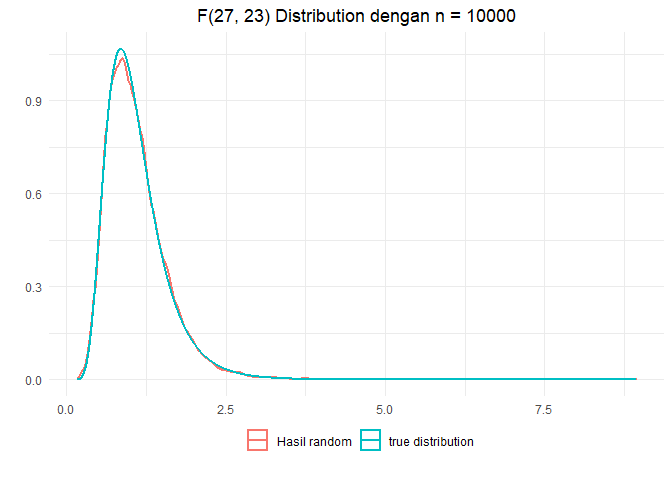
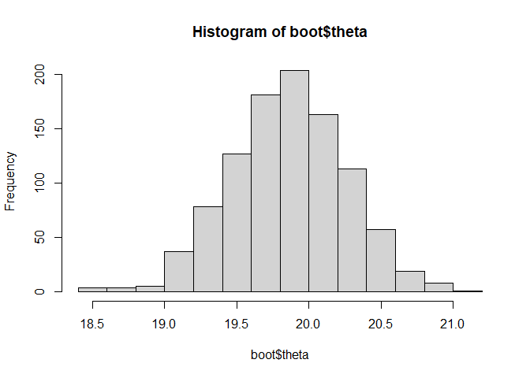
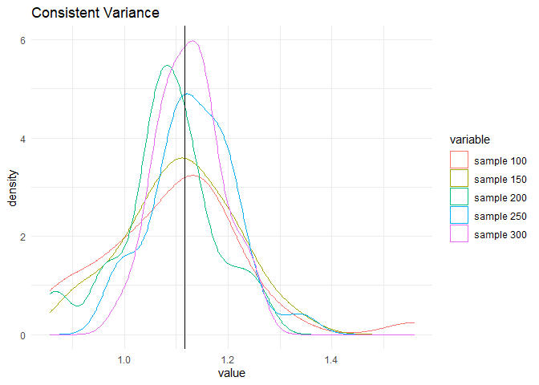
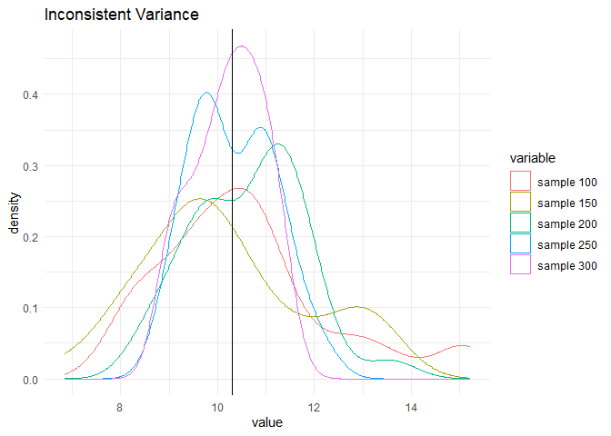
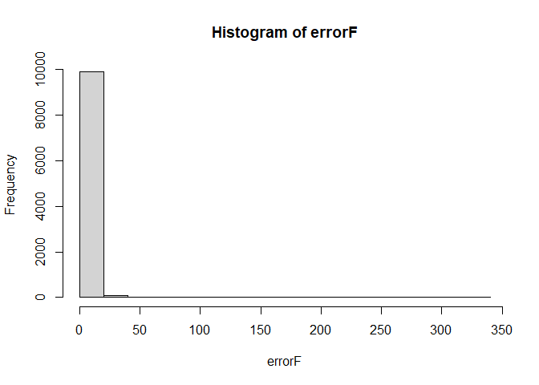
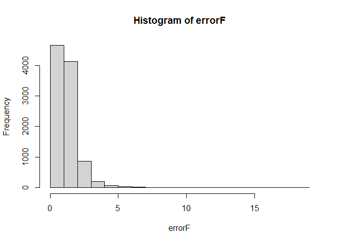
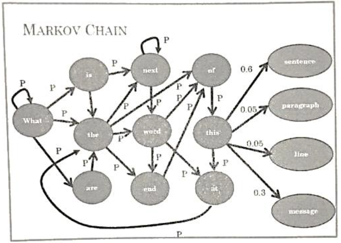

# Pembahasan UTS Tahun 2017/2018  

``` r
library(ggplot2)
library(reshape2)
library(dplyr)
```

Nomor 1
=======

### Soal


Jelaskan tujuan dari simulasi, serta berikan minimal 2 contoh simulasi
di bidang statistika.

### Tujuan Simulasi


1.  Untuk menguji setiap aspek dari perubahan yang diinginkan tanpa
    menempatkan objek yang dipelajari pada posisi dimaksud dan hasil
    simulasi memungkinan kita memilih ukuran yang tepat. Contoh
    kasusnya, simulasi biasanya digunakan untuk menguji kekuatan rancang
    bangun suatu konstruksi. Misalnya jembatan dapat disimulasikan
    sebelum benar-benar memulai pembangunan riil di lapangan.
2.  Untuk mengetahui mengapa suatu fenomena muncul. Mengapa suatu proses
    tidak berjalan sebagaimana mestinya. Anomali yang terjadi ada sistem
    yang disimulasi dapat diantisipasi sebelum diimplementasikan.
3.  Untuk mempelajari atau mengeksplorasi kemungkinan-kemungkinan
    pengembangan tanpa banyak mengeluarkan biaya dengan mengatur segala
    kemungkinan nilai-nilai dalam simulasi.
4.  Untuk mempercepat atau memperlambat suatu proses yang memungkinkan
    kita mengamatinya secara keseluruhan.
5.  Untuk mengetahui hubungan tentang variabel-variabel yang
    mempengaruhi suatu sistem yang kompleks.

### Contoh Simulasi di bidang Statistika


1.  Membangkitkan data dengan distribusi dan parameter yang diketahui
2.  Memvisualisasikan sifat-sifat distribusi atau uji statistika
    sehingga menjadi lebih mudah dipahami.
3.  Uji statistika berbasis simulasi, jika dukungan teori tentang
    distribusi tidak cukup.

Nomor 2
=======

### Soal


Pada suatu pengembangan algoritma khusus, anda membutuhkan untuk
membangkitkan data berdistribusi F. Jelaskan :

1.  Teori dari distribusi F
2.  Pseudocode untuk membangkitkan data berdistribusi F
3.  Implementasikan dengan R

### Teori Distribusi F


Distribusi *F* adalah distribusi dari semua kemungkinan nilai dari *f*
statitistic dengan *v*<sub>1</sub> = *n*<sub>1</sub> − 1 dan
*v*<sub>2</sub> = *n*<sub>2</sub> − 1. Kurva dari distribusi *F* sangat
bergantung pada degree of freedom, *v*<sub>1</sub> dan *v*<sub>2</sub>.
Hal yang perlu diingat bahwa *F*<sub>23, 27</sub> tidak sama dengan
*F*<sub>27, 23</sub>. Berikut pdf dari distribusi
*F*<sub>*v*<sub>1</sub>, *v*<sub>2</sub></sub>

$$
f(x) = \\frac{\\Gamma(\\frac{\\nu\_{1} + \\nu\_{2}} {2}) (\\frac{\\nu\_{1}} 
{\\nu\_{2}})^{\\frac{\\nu\_{1}} {2}} x^{\\frac{\\nu\_{1}} {2} - 1 }} 
{\\Gamma(\\frac{\\nu\_{1}} {2}) \\Gamma(\\frac{\\nu\_{2}} {2}) 
(1 + \\frac{\\nu\_{1}x} {\\nu\_{2}})^{\\frac{\\nu\_{1} + \\nu\_{2}} {2}} }
$$

dengan

*Γ*(*a*) = ∫<sub>0</sub><sup>∞</sup>*t*<sup>*a* − 1</sup>*e*<sup> − *t*</sup>*d**t*

Selain itu distribusi *F* juga dapat diperoleh dari transformasi
distribusi Chi-Square. Misalnya *X*<sub>1</sub> \~
*χ*<sub>*v*1</sub><sup>2</sup> dan *X*<sub>2</sub> \~
*χ*<sub>*v*2</sub><sup>2</sup>, maka

$$
Y = \\frac{X\_1/v\_1}{X\_2/v\_2}\\text{\~}F\_{v\_1,v\_2}
$$

### Pseudocode


1.  Bangkitkan *X*<sub>1</sub> dan *χ*<sub>*v*2</sub><sup>2</sup>
2.  Bangkitkan *X*<sub>2</sub> dan *χ*<sub>*v*2</sub><sup>2</sup>
3.  Lakukan tranformasi
    $$
    Y = \\frac{X\_1/v\_1}{X\_2/v\_2}
    $$
4.  Maka *Y* adalah data dari
    *F*<sub>*v*<sub>1</sub>, *V*<sub>2</sub></sub>

### Implementasi R


#### Membangkitkan Standar Normal

``` r
rand.z <- function(n){
      u1 <- runif(ceiling(n/2), 0, 1)
      u2 <- runif(ceiling(n/2), 0, 1)
      
      z1 <- sqrt(-2 * log(u1)) * cos(2 * pi * u2)
      z2 <- sqrt(-2 * log(u1)) * sin(2 * pi * u2)
      
      y <- c(z1, z2)
      y[1:n]
}
```

#### Membangkitkan Chi Square

``` r
rand.chi <- function(n, v){
      y <- rep(0, n)
      for(i in 1:v){
            z <- rand.z(n)
            y <- y + z^2
      }
      y
}
```

#### Membangkitkan *F*

``` r
rand.f <- function(n, v1, v2){
      chi1 <- rand.chi(n, v1)
      chi2 <- rand.chi(n, v2)
      (chi1/v1)/(chi2/v2)
}
```

#### Mencoba Fungsi

Misalkan kita ingin membangkitkan 10000 data random *F*<sub>27, 23</sub>

``` r
df1 <- 27
df2 <- 23
f <- rand.f(10000, df1, df2)
head(f, 10)
```

    ##  [1] 1.1580534 1.1825056 0.5681677 1.0815096 2.6586521 1.8022204 0.5971096
    ##  [8] 1.6882486 1.1031916 0.9823251

#### Visualisasi Hasil Random

``` r
ggplot() +
      geom_density(data = data.frame(x = f), 
                   aes(x, color = "Hasil random"), size = 1) +
      stat_function(fun = stats::df, n = 10000, args = list(df1 = df1, df2 = df2), 
                                size = 1, aes(color = "true distribution")) +
      labs(x = "", y = "", title = "F(27, 23) Distribution dengan n = 10000") +
      theme_minimal() +
      theme(legend.position = "bottom",
            legend.title = element_blank(),
            legend.box.margin = margin(-20, 0, 10, 0),
            plot.title = element_text(hjust = 0.5))
```



Terlihat bahwa hasil random sudah sangat menyerupai distribusi yang
sebenarnya

Nomor 3
=======

### Soal


Buatlah code untuk pseudocode di bawah ini dalam R Prosedur menghitung
integral
*I* = ∫<sub>*x*<sub>0</sub></sub><sup>*x*<sub>1</sub></sup>*g*(*x*)*d**x*
adalah:

1.  Bangkitkan *X*<sub>*i*</sub> \~
    *U*(*x*<sub>0</sub>, *x*<sub>1</sub>) untuk *i* = 1, 2, ..., *N* dan
    *N* yang relative besar.
2.  Hitung rata-rata *g*(*x*), yaitu $\\overline{g(x)}$
3.  Hitung $𝐼=(𝑥\_1 − 𝑥\_0) \\overline{g(x)}$

### Jawaban


#### Hitung Integral

``` r
integral <- function(gx, x0, x1, n = 100000){
      x <- runif(n, x0, x1) # soal bagian a
      rata2 <- mean(gx(x)) # soal bagian b
      (x1 - x0)*rata2 # soal bagian c
}
```

#### Mencoba Fungsi

Misalnya kita ingin mencari nilai dari
*I* = ∫<sub>0</sub><sup>2</sup>*x*<sup>2</sup>*d**x*

##### Definisikan Fungsi *g*(*x*)

``` r
gx <- function(x) x^2
```

##### Hitung Integral

``` r
set.seed(27)
x0 <- 0
x1 <- 2
integral(gx, x0, x1)
```

    ## [1] 2.650915

##### Fungsi Integral Bawaan R

``` r
integrate(gx, x0, x1)
```

    ## 2.666667 with absolute error < 3e-14

Terlihat bahwa perbedaan antara fungsi buatan sendiri dengan fungsi
bawaan R sangat kecil. Ketika *N* semakin besar maka perbedaannya maka
akan semakin kecil lagi.

Nomor 4
=======

### Soal


Buat algoritma boostrapping untuk pendugaan parameter regresi linear
sederhana. Lakukan simulasi yang memperlihatkan efek dari asumsi
normalitas yang tidak terpenuhi pada regresi linear sederhana

### Algoritma Bootstraping


Algoritma yang digunakan sama seperti yang diajarkan di komstat

#### Teori Bootstraping

Bootstrap adalah suatu metode yang dapat bekerja tanpa membutuhkan
asumsi distribusi karena sampel asli digunakan sebagai populasi.
Bootstrap dapat digunakan untuk mengatasi permasalahan dalam statistika
baik masalah data yang sedikit, data yang menyimpang dari asumsinya
maupun data yang tidak memiliki asumsi dalam distribusinya. Prosedur
untuk melakukan bootstrap sebagai berikut

1.  Menarik *n*-sampel acak dari suatu populasi sebanyak satu kali.
    (Mengambil sample *X*)
2.  Dari sampel yang didapat, lakukan resample dengan pengembalian
    (non-parametrik) atau ambil sub-sampel acak dari distribusi teoritis
    populasi yang diasumsikan dengan estimasi parameter dari data sampel
    yang didapat (parametrik)
3.  Dari sub-sampel yang ada, estimasikan nilai parameter yang ingin
    didapat, dinotasikan dengan
    *θ̂*<sub>*b*1</sub>, *θ̂*<sub>*b*2</sub>, ..., *θ̂*<sub>*b**B*</sub> ,
    bentuk umumnya *θ̂*<sub>*b**i*</sub>
4.  Ulangi langkah 2 dan 3 sebanyak *B* kali yang mungkin
    (direkomendasikan *B* = 1000 atau lebih untuk mengestimasi
    confidence Interval)
5.  Dari semua estimasi parameter sub-sampel
    *θ̂*<sub>*b*1</sub>, *θ̂*<sub>*b*2</sub>, ..., *θ̂*<sub>*b**B*</sub>,
    hitung rata – ratanya untuk mendapatkan estimasi parameter dan
    standard deviasinya untuk nilai standard error

#### Implementasi di R

##### Membuat Fungsi Sendiri

``` r
bootstrap <- function(x, iter = 1000, FUN = "mean", alpa = 0.05, ...){
      theta <- NULL
      n <- length(x)
      for(i in 1:iter){
            my_sample <- sample(x, replace = TRUE)
            theta[i] <- do.call(FUN, list(my_sample, ...))
      }
      rata2 <- mean(theta)
      bias <-  mean(theta) - mean(x)
      se <- sd(theta)
      lower_confidence <- rata2 - qt(alpa/2, n -1, lower.tail = FALSE) * se
      upper_confidence <- rata2 + qt(alpa/2, n -1, lower.tail = FALSE) * se
      
      list(theta = theta,
           mean_theta = rata2,
           bias = bias,
           se = se,
           lower_ci = lower_confidence,
           upper_ci = upper_confidence,
           alpa = alpa,
           iter = iter,
           FUN = substitute(FUN))
}
```

##### Mencoba Fungsi Buatan

``` r
set.seed(10127)
x <- rnorm(100, mean = 20, sd = 4)
boot <- bootstrap(x, FUN = "mean")
boot[-1]
```

    ## $mean_theta
    ## [1] 19.85862
    ## 
    ## $bias
    ## [1] -0.003407137
    ## 
    ## $se
    ## [1] 0.3981995
    ## 
    ## $lower_ci
    ## [1] 19.06851
    ## 
    ## $upper_ci
    ## [1] 20.64874
    ## 
    ## $alpa
    ## [1] 0.05
    ## 
    ## $iter
    ## [1] 1000
    ## 
    ## $FUN
    ## [1] "mean"

``` r
hist(boot$theta)
```



### Efek Normalitas Pada Regresi I


Jawaban ini berdasarkan modul tahun sebelumnya dan saya juga tidak
mengerti interpertasi dari hasilnya (hanya copas kode dan dimodul
sebelumnya juga tidak ada penjelasannya)

#### Error Normal

``` r
set.seed(1)
x1 <- runif(500) * 5
e1 <- rnorm(500)

y1 <- 3 + 7 * x1 + e1

data1 <- data.frame(x1, y1)
make_var <- function(sample, data) {
  tmp <- NULL
  for (i in 1:30) {
    fit <- lm(y1 ~ x1, data = data[sample(nrow(data), sample),])
    tmp[i] = var(resid(fit))
  }
  return(tmp)
}

data11 <- data.frame(index = 1:30)
for (i in seq(100, 300, 50)) {
   data_tmp1 <- make_var(i, data1)
   data11 <- mutate(data11,!!paste("sample", i) := data_tmp1)
}

tmp.plot.1 <- melt(data11, id.vars = 'index')
ggplot(tmp.plot.1, 
       aes(x = value, colour = variable)) +
   geom_density() + 
   geom_vline(xintercept = var(e1)) +
   ggtitle("Consistent Variance") +
   theme_minimal()
```



#### Error Tidak Normal

``` r
set.seed(1)
x1 <- runif(500) * 5
e1 <- rchisq(500, 5)

y1 <- 3 + 7 * x1 + e1

data1 <- data.frame(x1, y1)
make_var <- function(sample, data) {
  tmp <- NULL
  for (i in 1:30) {
    fit <- lm(y1 ~ x1, data = data[sample(nrow(data), sample),])
    tmp[i] = var(resid(fit))
  }
  return(tmp)
}

data11 <- data.frame(index = 1:30)
for (i in seq(100, 300, 50)) {
   data_tmp1 <- make_var(i, data1)
   data11 <- mutate(data11,!!paste("sample", i) := data_tmp1)
}

tmp.plot.1 <- melt(data11, id.vars = 'index')
ggplot(tmp.plot.1, 
       aes(x = value, colour = variable)) +
   geom_density() + 
   geom_vline(xintercept = var(e1)) +
   ggtitle("Inconsistent Variance") +
   theme_minimal()
```



### Efek Normalitas Pada Regresi II


Disimulasi ini akan melihat nilai p-value dari estimasi parameter
regresi dan nilai r squarenya

#### Buat Fungsi

``` r
simulateRegresi <- function(a, b, errorNonNorm, n = 100, loop = 100){
   normPValue <- NULL
   normR2 <- NULL
   normEstimasi <- NULL
   nonNormPValue <- NULL
   nonNormR2 <- NULL
   nonNormEstimasi <- NULL
   
   errorNorm <- rnorm(10000)
   
   for (i in 1:loop){
      e1 <- sample(errorNorm, size = n)
      e2 <- sample(errorNonNorm, size = n)
      x <- runif(n)
   
      y1 <- a*x + b + e1
      y2 <- a*x + b + e2
      df <- data.frame(x, y1, y2)
   
      model1 <- summary(lm(y1 ~ x, data = df))
      normEstimasi[i] <- model1$coefficients[2]
      normPValue[i] <- model1$coefficients[8]
      normR2[i] <- model1$r.squared
      
      model2 <- summary(lm(y2 ~ x, data = df))   
      nonNormEstimasi[i] <- model2$coefficients[2]
      nonNormPValue[i] <- model2$coefficients[8]
      nonNormR2[i] <- model2$r.squared
   }
   data.frame(p_value_norm = normPValue,
              p_value_non_norm  = nonNormPValue,
              estimasi_norm = normEstimasi,
              estimasi_non_norm = nonNormEstimasi,
              r2_norm = normR2,
              r2_non_norm = nonNormR2)
}
```

#### Coba Fungsi

Misalnya errornya akan digunakan dari distrbusi *F*(1, 4) dengan model
regresi sebagai berikut

*Y*<sub>*i*</sub> = 7*X*<sub>*i*</sub> + 72 + *ϵ*<sub>*i*</sub>

``` r
set.seed(32)
errorF <- rf(10000, 1, 4)
hist(errorF)
```



``` r
loop <- 100
n <- 100
a <- 7
b <- 72
sim <- simulateRegresi(a, n, errorF, n, loop)
round(sapply(sim, mean), 3)
```

    ##      p_value_norm  p_value_non_norm     estimasi_norm estimasi_non_norm 
    ##             0.000             0.029             6.995             6.910 
    ##           r2_norm       r2_non_norm 
    ##             0.802             0.268

Error yang digunakan sangat menceng kanan dan tidak normal dan terlihat
bahwa p-value dari model yang menggunakan error dari distribusi
*F*(1, 4) signifikan di 5% tetapi memiliki nilai rata-rata R-Squared
yang sangat kecil

Kita coba lagi dengan error dari *F*(27, 10)

``` r
errorF <- rf(10000, 27, 10)
hist(errorF)
```



``` r
loop <- 100
n <- 100
a <- 7
b <- 72
sim <- simulateRegresi(a, n, errorF, n, loop)
round(sapply(sim, mean), 3)
```

    ##      p_value_norm  p_value_non_norm     estimasi_norm estimasi_non_norm 
    ##             0.000             0.000             6.989             7.026 
    ##           r2_norm       r2_non_norm 
    ##             0.807             0.858

Akan tetapi terlihat ketika dignakan *F*(27, 10) ternyata modelnya jauh
lebih bagus dari model yang memiliki error normal.

**Jadi kesimpulannya apa?** Entah saya juga tak mengerti :v, silahkan
coba error dengan distribusi lain! Saya sudah mencobanya tetap saja
nilai p-value yang dihasilkan akan kecil kecuali error yang digunakan
sangat menceng seperti *F*(1, 1), *F*(2, 2) dan sebagainya. Entah metode
simulasi yang saya gunakan salah atau seperti apa, saya kurang mengerti.
**Kalau ada yang tau, MOHON BANTUANNYA UNTUK DIKOREKSI!**

**Jawaban by Arina Mana Sikana**, [disini](https://github.com/modul60stis/simdat-uts/tree/main/4-efek-normalitas#efek-normalitas-)

Nomor 5
=======

### Soal


Jelaskan gambar dibawah ini!



### Jawaban


Rantai Markov digunakan untuk peramalan perubahan pada variabel-variabel
tertentu berdasarkan pengetahuan dari perubahan sebelumnya. Seperti
gambar pada soal, ide dasarnya adalah menggambar lingkaran untuk setiap
kata, panah antara masing-masing dua kata dengan transisi, dan label
masing-masing panah yang menggambarkan probabilitas (P) untuk menuju
sentence, paragraph, line atau message

#### Catatan

Kurang ngerti juga saya, silahkan baca sendiri disini

1.  [Pengertian Markov Chain dan Contoh
    Pengaplikasiannya](https://www.pengadaanbarang.co.id/2020/10/pengertian-markov-chain-dan-contoh.html)
2.  [Markov Chain](https://socs.binus.ac.id/2013/06/30/markov-chain/)
3.  [Introduction to Markov
    Chains](https://towardsdatascience.com/introduction-to-markov-chains-50da3645a50d)
4.  [A Gentle Introduction to Markov Chain Monte Carlo for
    Probability](https://machinelearningmastery.com/markov-chain-monte-carlo-for-probability/)


