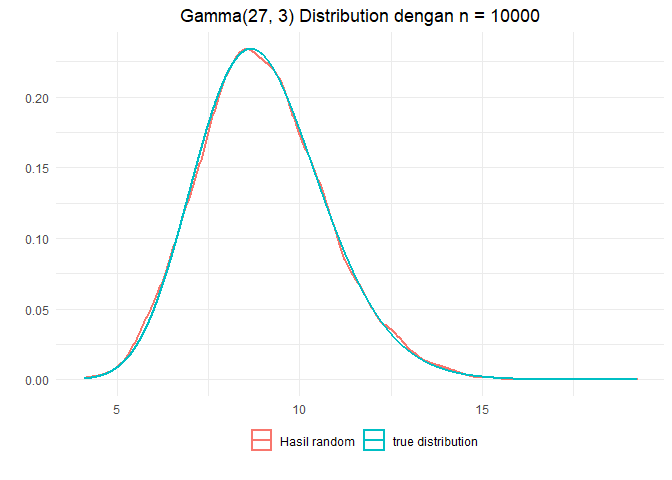

# Pembahasan UTS Tahun 2018/2019  

``` r
library(ggplot2)
```

Nomor 1
=======

### Soal


Jelaskan tujuan dari simulasi, serta berikan minimal 2 contoh simulasi
di bidang statistika.

### Tujuan Simulasi


1.  Untuk menguji setiap aspek dari perubahan yang diinginkan tanpa
    menempatkan objek yang dipelajari pada posisi dimaksud dan hasil
    simulasi memungkinan kita memilih ukuran yang tepat. Contoh
    kasusnya, simulasi biasanya digunakan untuk menguji kekuatan rancang
    bangun suatu konstruksi. Misalnya jembatan dapat disimulasikan
    sebelum benar-benar memulai pembangunan riil di lapangan.
2.  Untuk mengetahui mengapa suatu fenomena muncul. Mengapa suatu proses
    tidak berjalan sebagaimana mestinya. Anomali yang terjadi ada sistem
    yang disimulasi dapat diantisipasi sebelum diimplementasikan.
3.  Untuk mempelajari atau mengeksplorasi kemungkinan-kemungkinan
    pengembangan tanpa banyak mengeluarkan biaya dengan mengatur segala
    kemungkinan nilai-nilai dalam simulasi.
4.  Untuk mempercepat atau memperlambat suatu proses yang memungkinkan
    kita mengamatinya secara keseluruhan.
5.  Untuk mengetahui hubungan tentang variabel-variabel yang
    mempengaruhi suatu sistem yang kompleks.

### Contoh Simulasi di bidang Statistika


1.  Membangkitkan data dengan distribusi dan parameter yang diketahui
2.  Memvisualisasikan sifat-sifat distribusi atau uji statistika
    sehingga menjadi lebih mudah dipahami.
3.  Uji statistika berbasis simulasi, jika dukungan teori tentang
    distribusi tidak cukup.

Nomor 2
=======

### Soal


Pada suatu pengembangan algoritma khusus, anda membutuhkan untuk
membangkitkan data berdistribusi Gamma. Jelaskan :

1.  Teori dari distribusi Gamma
2.  Pseudocode untuk membangkitkan data berdistribusi Gamma
3.  Implementasikan dengan R

### Teori Distribusi Gaamma


Distribusi Gamma adalah distribusi peluang kontinu yang banyak digunakan
dalam berbagai bidang ilmu untuk memodelkan variabel kontinu yang selalu
positif dan memiliki distribusi miring. Distribusi Gamma sering
digunakan untuk memodelkan waktu tunggu hingga suatu event terjadi
sebanyak *k* kali. Berikut pdf dari distribusi Gamma

$$
f(x) = \\frac{(\\frac{x-\\mu}{\\beta})^{\\gamma - 1}\\exp{(-\\frac{x-\\mu}
{\\beta}})} {\\beta\\Gamma(\\gamma)}  \\hspace{.2in}  x \\ge \\mu; \\gamma,
\\beta \> 0
$$

dimana *γ* merupakan shape parameter, *μ* merupakan location parameter
*β* merupakan scale parameter, dan *Γ* merupakan fungsi dengan formula

*Γ*(*a*) = ∫<sub>0</sub><sup>∞</sup>*t*<sup>*a* − 1</sup>*e*<sup> − *t*</sup>*d**t*

Selain itu distribusi Gamma juga dapat diperoleh dari transformasi
distribusi Uniform. Misalnya
*U*<sub>1</sub>, *U*<sub>2</sub>, ..., *U*<sub>*α*</sub> berdistribusi
*U*(0, 1) dan bersifat iid, maka

$$
Gamma(\\alpha, \\beta) = -\\frac{1}{\\beta}(\\ln{U\_1} + \\ln{U\_2} + ... + \\ln{U\_\\alpha})
$$

### Pseudocode


1.  Bangkitkan *U*<sub>1</sub>, *U*<sub>2</sub>, ..., *U*<sub>*α*</sub>,
    yang mana *U*<sub>*i*</sub> \~ *U*(0, 1) dan bersifat iid
2.  Lakukan tranformasi
    $$
    Y = -\\frac{1}{\\beta}(\\ln{U\_1} + \\ln{U\_2} + ... + \\ln{U\_\\alpha})
    $$
3.  Maka *Y* adalah data dari Gamma(, )

### Implementasi R


#### Buat Fungsi

``` r
rand.gamma <- function(n, alpha, beta){
      y <- rep(0, n)
      for(i in 1:alpha){
            u <- runif(n)
            y <- y + log(u)
      }
      -(1/beta) * y
}
```

#### Mencoba Fungsi

Misalnya kita ingin membangkitkan data dari distribusi
*G**a**m**m**a*(27, 3)

``` r
set.seed(72)
alpha <- 27
beta <- 3
y <- rand.gamma(10000, alpha, beta)
head(y, 10)
```

    ##  [1]  6.394094  7.502856  8.240455  8.525452  8.899637 11.408713 10.492305
    ##  [8] 10.307569  8.107659 10.603716

#### Memvisualisasikan

``` r
ggplot() +
      geom_density(data = data.frame(x = y), 
                   aes(x, color = "Hasil random"), size = 1) +
      stat_function(fun = dgamma, n = 10000, args = list(shape = alpha, rate = beta), 
                                size = 1, aes(color = "true distribution")) +
      labs(x = "", y = "", title = "Gamma(27, 3) Distribution dengan n = 10000") +
      theme_minimal() +
      theme(legend.position = "bottom",
            legend.title = element_blank(),
            legend.box.margin = margin(-20, 0, 10, 0),
            plot.title = element_text(hjust = 0.5))
```



Terlihat bahwa hasil random sudah sangat menyerupai distribusi yang
sebenarnya

Nomor 3
=======

### Soal


Lakukan simulasi yang memperlihatkan efek dari asumsi normalitas yang
tidak terpenuhi pada Anova one-way

### Jawaban


**Jawaban dibawah ini berdasarkan jawaban dari modul tahun sebelumnya**

Pertama, kita akan lakukan simulasi pada data berdistribusi normal
sebagai pembanding dengan simulasi data tidak berdistribusi normal
nantinya.

``` r
p <- c()
set.seed(123)
for (i in 1:1000) {
   test <- data.frame(Distribusi = c(rep("Kategori 1",13), rep("Kategori 2",20), rep("Kategori 3",7)), Angka = rnorm(40,10,5))
   p[i] <- summary(aov(Angka~Distribusi, data = test))[[1]]$'Pr(>F)'[1]
}

tapply(test$Angka, test$Distribusi, shapiro.test)
```

    ## $`Kategori 1`
    ## 
    ##  Shapiro-Wilk normality test
    ## 
    ## data:  X[[i]]
    ## W = 0.92166, p-value = 0.2641
    ## 
    ## 
    ## $`Kategori 2`
    ## 
    ##  Shapiro-Wilk normality test
    ## 
    ## data:  X[[i]]
    ## W = 0.94748, p-value = 0.3304
    ## 
    ## 
    ## $`Kategori 3`
    ## 
    ##  Shapiro-Wilk normality test
    ## 
    ## data:  X[[i]]
    ## W = 0.90933, p-value = 0.3912

Data berdistribusi normal pada seluruh kategori.

``` r
sum(p<0.05)
```

    ## [1] 44

Terlihat bahwa dengan iterasi sebanyak 1000 kali, p-value yang
dihasilkan ada sebanyak 44.\* Hal ini menunjukkan dearah tolak H0
(maksimal 50 dari 1000 pengujian)

Selanjutnya kita akan lakukan simulasi pada data tidak berdistribusi
normal

``` r
p <- c()
set.seed(123)
for (i in 1:1000) {
   test <- data.frame(Distribusi = c(rep("Kategori 1",13), rep("Kategori 2",20), rep("Kategori 3",7)), Angka = c(rchisq(13,3), rf(20,11,15),
   runif(7,0,5)))
   p[i] <- summary(aov(Angka~Distribusi, data = test))[[1]]$'Pr(>F)'[1]
}

tapply(test$Angka, test$Distribusi, shapiro.test)
```

    ## $`Kategori 1`
    ## 
    ##  Shapiro-Wilk normality test
    ## 
    ## data:  X[[i]]
    ## W = 0.85516, p-value = 0.03327
    ## 
    ## 
    ## $`Kategori 2`
    ## 
    ##  Shapiro-Wilk normality test
    ## 
    ## data:  X[[i]]
    ## W = 0.93842, p-value = 0.2238
    ## 
    ## 
    ## $`Kategori 3`
    ## 
    ##  Shapiro-Wilk normality test
    ## 
    ## data:  X[[i]]
    ## W = 0.93606, p-value = 0.6036

Data tidak normal pada Kategori 1. Simulasi data tidak normal dapat
dilanjutkan pada “p”

``` r
sum(p<0.05)
```

    ## [1] 885

Terlihat bahwa dengan iterasi sebanyak 1000 kali, p-value yang
dihasilkan ada sebanyak 885. Hal ini menunjukkan bahwa pelanggaran
asumsi normalitas pada ANOVA akan mengakibatkan daerah tolak H0-nya
lebih besar (maksimal 50 dari 1000 pengujian)

### Catatan


Ada beberapa hal yang masih mengganjal dari simulasi diatas

1.  Anova kan menguji apakah rata-rata kategori 1-3 memiliki rata-rata
    yang sama. Nah apakah perlu rata-rata kategori 1 pada percobaan 1
    harus dijaga tetap sama dengan rata-rata kategori 1 pada percobaan
    2, begitu juga dengan rata-rata pada kategori 2 dan 3?
2.  Yang diuji shapiro wilk pada simulasi diatas hanya pada data random
    loop ke 1000.
3.  Bukannya ketika ingin melakukan simulasi kita harus menjaga kondisi
    selain yang diuji tetap sama? Dalam kasus ini berarti kita harus
    dapat merancang sebuah percobaan dimana percobaan 1 dan 2 memiliki
    data dengan properti yang hanya berbeda pada normalitasnya saja (?)
4.  Apakah p-value sudah cocok untuk menjadi alat pengukuran performa
    dari simulasi ini? Apakah power test bisa digunakan untuk alat
    mengukuran performa dari simulasi ini?

**Kalau ada yang tau, mohon bantuannya!!!**

**Jawaban by Arina Mana Sikana**, [disini](https://github.com/modul60stis/simdat-uts/tree/main/4-efek-normalitas#efek-normalitas-)

Nomor 4
=======

### Soal


Lakukan Analisa data pada data country facts yang terdapat di dalam file
CountryData.csv. Jelaskan langkah-langkah yang dilakukan serta
interpretasikan hasil yang diperoleh

### Jawaban


Tidak dapat diparktekkan karena data `CountryData.csv` tidak ada. Jika
pun nanti ada soal seperti ini bisa menjawabnya dengan membuat beberapa
plot data kemudian meng interpertasikannya, seperti yang dilakukan saat
mata kuliah komstat yaitu Data Wrangling


