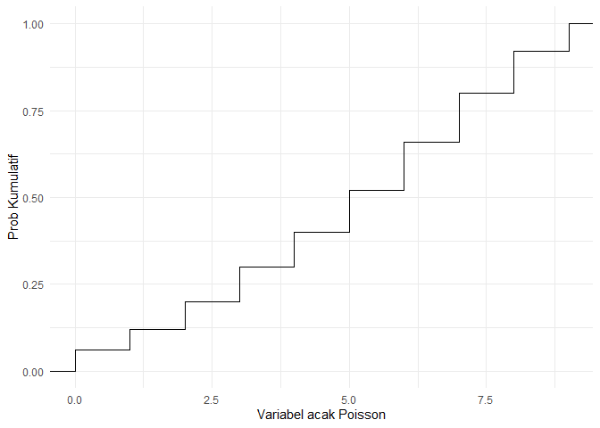
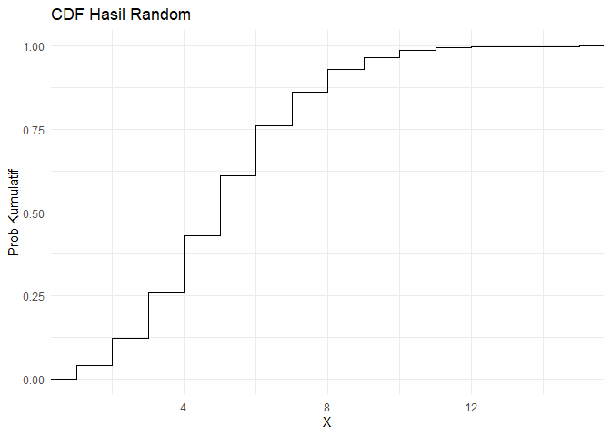
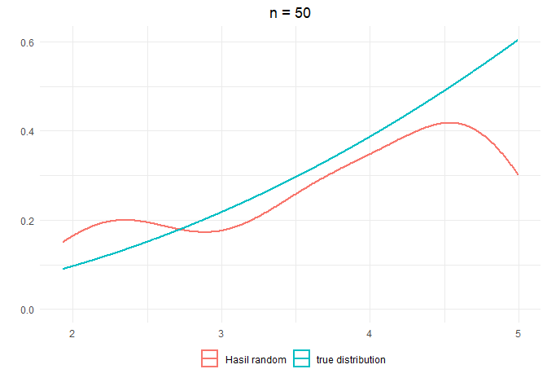
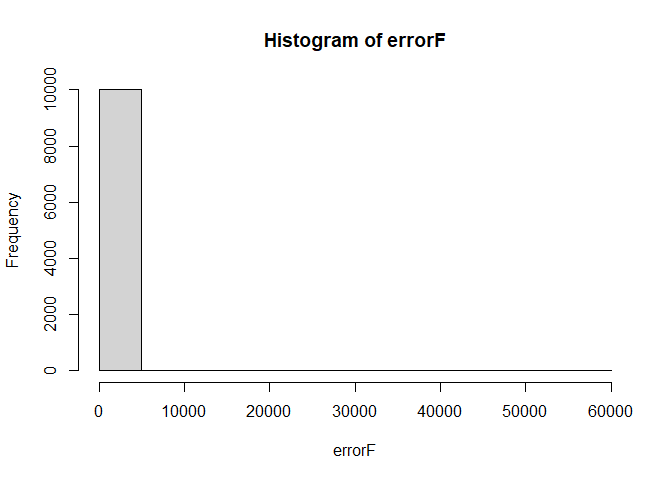

# Pembahasan UTS Tahun 2019/2020  

``` r
library(ggplot2)
```

NOMOR 1
=======

### SOAL


Anda sedang mengamati sebuah toko untuk menghitung jumlah pelanggan yang
datang perjam. Pengamatan dilakukan selama 5 × 10 jam dan data
pengamatan sebagai berikut.

``` r
data <- data.frame(i = seq(0, 9),
                   freq = c(3,3,4,5,5,6,7,7,6,4))
colnames(data) <- c("Jumlah pelanggan per jam", "Frekuensi")
knitr::kable(data)
```

|  Jumlah pelanggan per jam|  Frekuensi|
|-------------------------:|----------:|
|                         0|          3|
|                         1|          3|
|                         2|          4|
|                         3|          5|
|                         4|          5|
|                         5|          6|
|                         6|          7|
|                         7|          7|
|                         8|          6|
|                         9|          4|

### A


Jelaskan apa distribusi dari data tersebut dan bagaimanakah plot cdf
dari variabel acak tersebut? Gambarkan!

#### Distribusi Data

Data berisi frekuensi pelanggan yang dihitung dalam selang waktu 1 jam.
Sehingga dapat dikatakan bahwa data berdistribusi poisson, di mana
distribusi Poisson merupakan sebaran yang menyatakan peluang sejumlah
kejadian yang terjadi dalam interval waktu tertentu dengan rata-rata
konstan dan independen terhadap waktu.

Distribusi poisson memiliki satu parameter yaitu lamda yang dapat dapat
diestimasi dengan estimasi likelihood dengan rumus

$$
\\lambda = \\frac{1}{n}\\sum\_i^nx\_i
$$

Karena data yang tersedia masih dalam bentuk tabel, maka

``` r
lambda <- sum(data$`Jumlah pelanggan per jam` * data$Frekuensi) / sum(data$Frekuensi)
lambda
```

    ## [1] 5.02

Jadi data diatas diperkirakan berdistribusi *P**o**i**s**s**o**n*(5.02)

#### Plot CDF Poisson

``` r
x <- c()
for(i in 1:nrow(data)){
  x <- c(x, rep(data$`Jumlah pelanggan per jam`[i], data$Frekuensi[i]))
}

ggplot(as.data.frame(x)) +
  stat_ecdf(aes(x)) +
  labs(x = "Variabel acak Poisson", y = "Prob Kumulatif") +
  theme_minimal()
```



B
-

Buatlah fungsi di dalam R untuk mensimulasikan sebanyak 𝑛 bilangan
variabel acak berdistribusi tersebut! Gunakan built-in function
`runif(1)`

#### Buat Fungsi

``` r
rand.pois <- function(n, lambda){
   x <- c()
   for(j in 1:n){
     i <- 1
     u <- runif(1)
     while(ppois(i, lambda) < u ){
        i <- i + 1
     }
     x[j] <- i
   }
   x
}
```

#### Generate *P**o**i**s**s**o**n*(5.02)

``` r
pois <- rand.pois(10000, lambda = lambda)
head(pois, 100)
```

    ##   [1]  8  4  8  7  3  5  7  7  3  7  4  3  3  6  4  7  5 11  8  3  5  6  6  9  1
    ##  [26]  8  7  5  8  5  1  4  5  4  5  7  5  8  7  3  8  6  3  6  5  3  5  8  6  3
    ##  [51] 10  4  5  6  2  6  4  7  5  3  2  7  6  6  1  9  6  7 11  5  2  3  7  3  9
    ##  [76]  3  6  3  6  7  7  3  3  5 11  4  7  5  2 10  6  5  4  1  4  2  5  3  5  5

#### Visualisasi Data

``` r
ggplot(as.data.frame(pois)) +
  stat_ecdf(aes(pois)) +
  labs(x = "X", y = "Prob Kumulatif", title = "CDF Hasil Random") +
  theme_minimal()
```



NOMOR 2
=======

Diketahui 𝑋 dengan fungsi kepadatan sebagai berikut

*f*(*x*) = *k**x*<sup>2</sup> untuk 1 \< *x* \< 5

### A


Fungsi kepadatan kumulatif dari *k**x*<sup>2</sup> dari 1 hingga 5 ialah
bernilai 1. Sehingga untuk mendapatkan k, perlu dicari nilai dari
integral fungsi tersebut.

``` r
fx <- function(x){
  x^2
}
```

``` r
c <- integrate(fx, 1, 5)
k <- 1/c$value
k
```

    ## [1] 0.02419355

Sehingga didapatkan nilai k sebesar 0.0242

Hasil tersebut sama dengan penghitungan manual yang akan memperoleh
$k=\\frac{3}{124}$

``` r
3/124
```

    ## [1] 0.02419355

### B


Buat program untuk membangkitkan 50 data dari 𝑋 dengan menggunakan
metode yang fungsi densitas tersebut, selanjutnya buat grafik
densitasnya.

#### Membuat Fungsi Densitas

``` r
batasBawah <- 1
batasAtas <- 5
fx <- function(x){
      y <- rep(0, length(x))
      for(i in 1:length(x)){
            if((batasBawah < x[i]) & (x[i] < batasAtas)) y[i] <- k*((x[i])^2)
            else y[i] <- 0
      }
      y
}
```

#### Fungsi Rejection

``` r
rejection <- function(fx, a, b, k){
      while (TRUE) {
            x <- runif(1, a, b)
            y <- runif(1, 0, k)
            if(y < fx(x)) return(x) 
      }
}
```

#### Fungsi Generate Random

``` r
rand.fx <- function(n){
      y <- rep(0, n)
      for(i in 1:n){
            y[i] <- rejection(fx, batasBawah, batasAtas, 1)
      }
      y
}
```

#### Visualisasi PDF

``` r
y <- rand.fx(50)

ggplot() +
      geom_density(data = data.frame(x = y), 
                   aes(x, color = "Hasil random"), size = 1) +
      stat_function(fun = fx, n = 10000, 
                                size = 1, aes(color = "true distribution")) +
      labs(x = "", y = "", title = "n = 50") +
      theme_minimal() +
      theme(legend.position = "bottom",
            legend.title = element_blank(),
            legend.box.margin = margin(-20, 0, 10, 0),
            plot.title = element_text(hjust = 0.5))
```



NOMOR 3
=======

Lakukan pendekatan Monte Carlo untuk menghitung dua fungsi integral di
bawah.

### Buat Fungsi Umum


``` r
int_montcar <- function(a, b, gx, n = 1e6){
  set.seed(7)
  x <- runif(n, a, b)
  y <- mean(gx(x))
  (int <- (b-a)*y)
}
```

### A


$$
\\int\_{-1}^2sin^2(\\sqrt{x^3+1})dx
$$

Membuat fungsi integral :

``` r
func_a <- function(x){
  sin(sqrt(x^3+1))^2
}
```

Kemudian, menghitung integral dengan batas atas = 2 dan batas bawah = -1

``` r
a <- -1
b <- 2
gx <- func_a

int_montcar(a, b, gx)
```

    ## [1] 1.99975

``` r
integrate(gx, a, b)
```

    ## 1.999806 with absolute error < 1.2e-09

Terlihat hasil perhitungan integral antara Monte Carlo dengan fungsi
integral bawaan R tidak berbeda jauh.

### B


∫<sub>0</sub><sup>2</sup>*c**o**s*<sup>2</sup>(10*x*<sup>2</sup>)*x**c**o**s*(*x*) + 0.5

Membuat fungsi integral :

``` r
func_b <- function(x){
  cos(10*x^2)^2 * x *cos(x) + 0.5
}
```

Kemudian, menghitung integral dengan batas atas = 2 dan batas bawah = 0

``` r
a <- 0
b <- 2
gx <- func_b

int_montcar(a, b, gx)
```

    ## [1] 1.206584

``` r
integrate(gx, a, b)
```

    ## 1.206724 with absolute error < 7.5e-06

Terlihat hasil perhitungan integral antara Monte Carlo dengan fungsi
integral bawaan R tidak berbeda jauh.

NOMOR 4
=======

### SOAL


Misal Anda diminta mempeajari sistem antrian di teller di dalam suatu
bank. Bank tersebut memiliki 3 teller, dengan sistem antrian tunggal
(nasabah mengantri di satu jalur)

1.  Gambarkan sistem antrian tersebut dalam bentuk diagram!
2.  Tulisakn objek-objek apa saja yang ada dalam sistem tersebut, dan
    jelaskan apakah objek tersebut termasuk objek sementara atau
    permanen?
3.  Apakah sistem tersebut termasuk sistem close loop atau open loop?
4.  Apakah saat melakukan pengamatan Anda akan menganggap sistem
    tersebut sebagai preskriptif atau deskriptif? Jelaskan!

### Jawaban


Jawaban ini agak ngaco, mohon dimaklumi :v

1.  -   

2.  Yang pasti ada objek `teller`, objek ini bersifat permanen yang mana
    akan selalu ada didalam sistem. Objek selanjutnya adalah `nasabah`,
    objek ini bersifat sementara, akan ada didalam sistem ketika nasabah
    belum menerima giliran dan urusannya dengan `teller` selesai. Cuman
    terpikirkan dua itu, ada lagi?
3.  Menurut saya sistem antrian ini termasuk sistem open loop karena
    tidak dapat dipastikan kapan nasabah akan mengujungi bank lagi dan
    masuk ke dalam sistem ini
4.  Menurut saya sistem antrian ini termasuk dalam sistem deskriptif,
    karena peneliti tidak memiliki kebebasan secara utuh untuk merubah
    sistemnya. Sistem ini sangat bergantung pada lama waktu transaksi
    setiap nasabah di teller tersebut

NOMOR 5
=======

### SOAL


Lakukan simulasi yang memperlihatkan efek dari asumsi normalitas yang
tidak terpenuhi pada ANOVA dan regresi. Jelaskan setiap langkah yang
dilakukan.

### Efek Normalitas pada Regresi


Disimulasi ini akan melihat nilai p-value dari estimasi parameter
regresi dan nilai r squarenya. Tahapan yang dilakukan

1.  Buat dua error yaitu, *ϵ*<sub>1</sub> yang berdistribusi normal dan
    *ϵ*<sub>2</sub> yang tidak berdistribusi normal
2.  Generate *X* dari distribusi uniform
3.  Tentukan *a* dan *b*
4.  Buat variabel *Y*<sub>1</sub> dengam transformasi
    *Y*<sub>1</sub> = *a* + *b**X* + *ϵ*<sub>1</sub>
5.  Buat variabel *Y*<sub>2</sub> dengam transformasi
    *Y*<sub>2</sub> = *a* + *b**X* + *ϵ*<sub>2</sub>
6.  Buat model pertama dengan meregresikan *Y*<sub>1</sub> dan *X*
7.  Buat model kedua dengan meregresikan *Y*<sub>2</sub> dan *X*
8.  Bandingkan perbedaan model pertama dan kedua dengan melihat nilai
    dari `p-value`, `estimasi b`, dan `r-squared`

#### Membuat fungsi

``` r
simulateRegresi <- function(a, b, errorNonNorm, n = 100, loop = 100){
   normPValue <- NULL
   normR2 <- NULL
   normEstimasi <- NULL
   nonNormPValue <- NULL
   nonNormR2 <- NULL
   nonNormEstimasi <- NULL
   
   errorNorm <- rnorm(10000)
   
   for (i in 1:loop){
      e1 <- sample(errorNorm, size = n)
      e2 <- sample(errorNonNorm, size = n)
      x <- runif(n)
   
      y1 <- a*x + b + e1
      y2 <- a*x + b + e2
      df <- data.frame(x, y1, y2)
   
      model1 <- summary(lm(y1 ~ x, data = df))
      normEstimasi[i] <- model1$coefficients[2]
      normPValue[i] <- model1$coefficients[8]
      normR2[i] <- model1$r.squared
      
      model2 <- summary(lm(y2 ~ x, data = df))   
      nonNormEstimasi[i] <- model2$coefficients[2]
      nonNormPValue[i] <- model2$coefficients[8]
      nonNormR2[i] <- model2$r.squared
   }
   data.frame(p_value_norm = normPValue,
              p_value_non_norm  = nonNormPValue,
              estimasi_norm = normEstimasi,
              estimasi_non_norm = nonNormEstimasi,
              r2_norm = normR2,
              r2_non_norm = nonNormR2)
}
```

#### Mencoba Fungsi

Misalnya errornya akan digunakan dari distrbusi F(9,2) dengan model
regresi sebagai berikut

``` r
set.seed(32)
errorF <- rf(10000, 9, 2)
hist(errorF)
```



``` r
loop <- 100
n <- 100
a <- 7
b <- 72
sim <- simulateRegresi(a, n, errorF, n, loop)
round(sapply(sim, mean), 3)
```

    ##      p_value_norm  p_value_non_norm     estimasi_norm estimasi_non_norm 
    ##             0.000             0.251             6.994             0.905 
    ##           r2_norm       r2_non_norm 
    ##             0.801             0.043

Ternyata ketika residual berdistribusi normal, p-value lebih kecil dari
alpha sehingga dapat dikatakan koefisien regresi signifikan terhadap
model. Berbeda dengan ketika residual tidak berdistribusi normal,
koefisien tidak signifikan terhadap model.

Dari R square juga dapat dilihat bahwa ketika residual berdistribusi
normal, R square tinggi sehingga dapat menjelaskan model dengan baik.
Berkebalikan dengan ketika residual tidak berdistribusi normal.

Akan tetapi ketika distribusi F diubah parameternya atau distribusi F
diubah dengan distribusi lainnya maka hasil simulasinya akan beda juga.
Soal ini sudah pernah ada pada soal UTS tahun 2017/2018, cek
[disini](https://github.com/modul60stis/simdat-uts/tree/main/pembahasan-2017-2018#efek-normalitas-pada-regresi-i)

### Efek Normalitas pada Anova One Way


Soal ini sudah muncul pada tahun UTS 2018/2019. Cek
[disini](https://github.com/modul60stis/simdat-uts/tree/main/pembahasan-2018-2019#soal-2)

